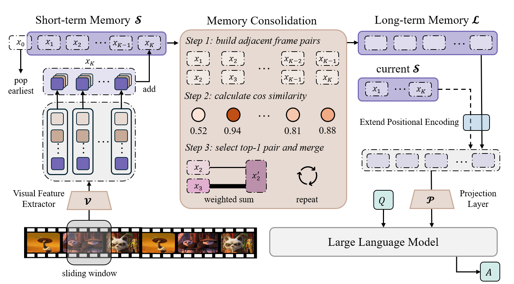
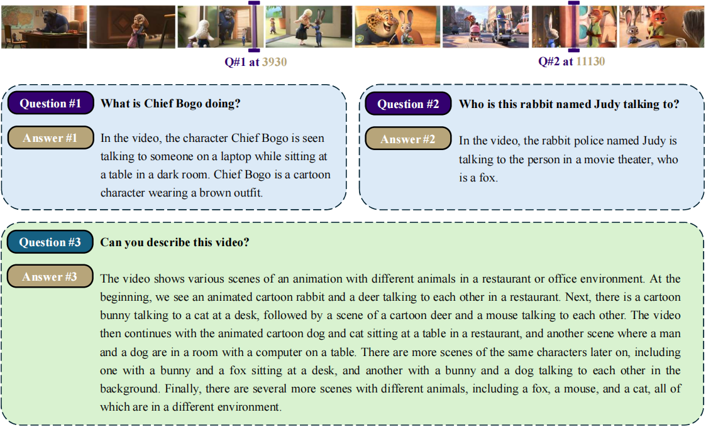
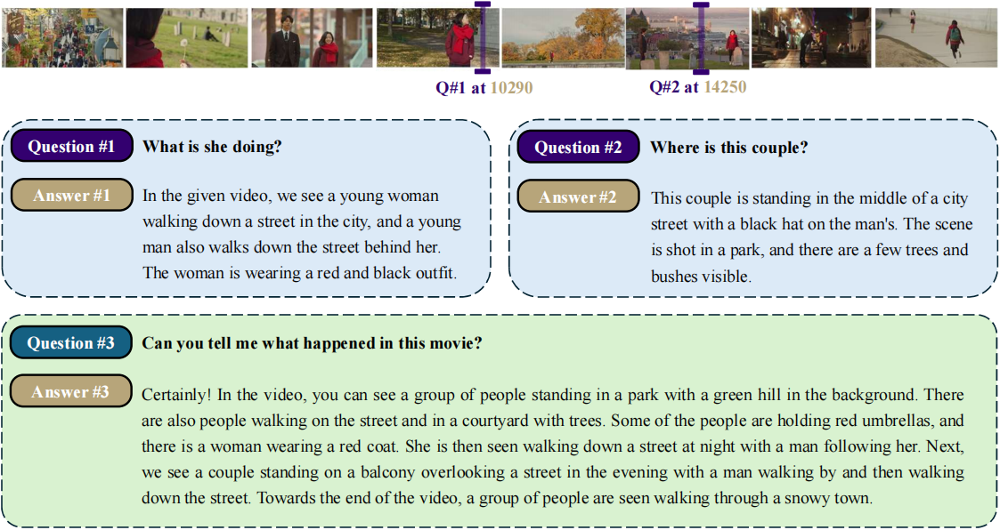
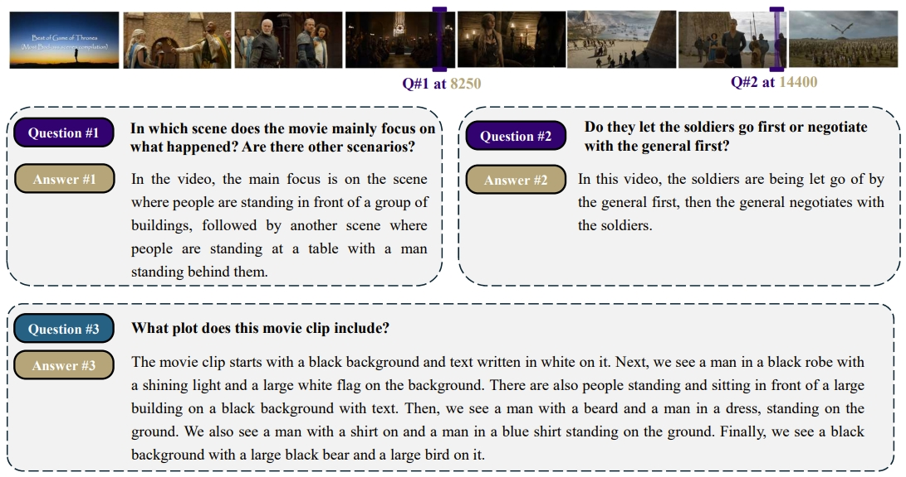
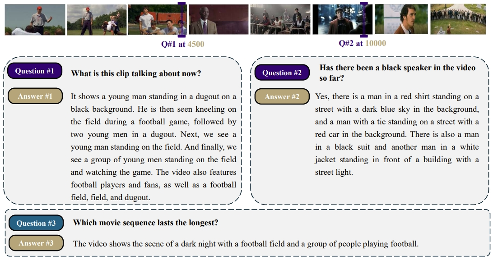
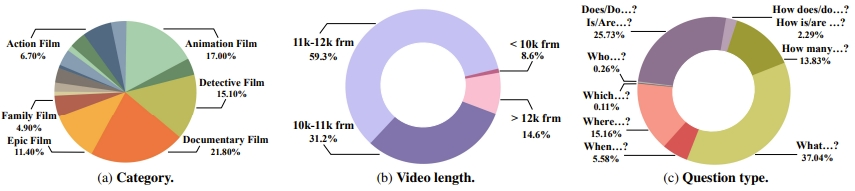
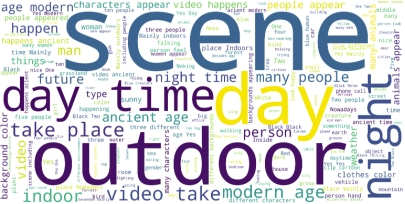

# MovieChat

[](https://arxiv.org/abs/2307.16449)

> **MovieChat: From Dense Token to Sparse Memory for Long Video Understanding**  
> Enxin Song*, Wenhao Chai*, Guanhong Wang*, Yucheng Zhang, Haoyang Zhou, Feiyang Wu, Xun Guo, Tian Ye, Yan Lu, Jenq-Neng Hwang, Gaoang Wang✉️   
> _arXiv 2023._

MovieChat can handle videos with >10K frames on a 24GB graphics card. MovieChat has a 10000× advantage over other methods in terms of the average increase in GPU memory cost per frame (21.3KB/f to ~200MB/f).
<p align="center" width="100%">
<a target="_blank"></a>
</p>

<h5 align="center"> If you like our project, please give us a star ⭐ on GitHub for the latest update.</h5>

## :fire: News
* **[2023.11.27]** :page_with_curl: We update the [paper](https://arxiv.org/pdf/2307.16449v2.pdf) with implementation details, technical evaluations, and dataset information.
* **[2023.11.23]** : We update the latest source code of MovieChat.
* **[2023.8.1]** :page_with_curl: We release the [paper](https://arxiv.org/abs/2307.16449).
* **[2023.7.31]** We release eval [code and instraction](https://github.com/rese1f/MovieChat/tree/main/eval_code) for short video QA on **MSVD-QA**, **MSRVTT-QA** and **ActivityNet-QA**.
* **[2023.7.29]** We release [Gradio demo](https://github.com/rese1f/MovieChat/tree/main/Gradio_demo) of MovieChat.
* **[2023.7.22]** We release source code of MovieChat.
  

[](https://paperswithcode.com/sota/zeroshot-video-question-answer-on-activitynet?p=moviechat-from-dense-token-to-sparse-memory)\
[](https://paperswithcode.com/sota/zeroshot-video-question-answer-on-msrvtt-qa?p=moviechat-from-dense-token-to-sparse-memory)\
[](https://paperswithcode.com/sota/zeroshot-video-question-answer-on-msvd-qa?p=moviechat-from-dense-token-to-sparse-memory)
[](https://paperswithcode.com/sota/zero-shot-long-video-global-mode-question?p=moviechat-from-dense-token-to-sparse-memory)
[](https://paperswithcode.com/sota/zero-shot-long-video-breakpoint-mode-question?p=moviechat-from-dense-token-to-sparse-memory)


## 💡 Overview



## 📣 Demo Video

[](https://www.youtube.com/embed/Dx5BQmgK4n8?si=FN9pLyQBN--vJBZA)

## ⚡ Comparison Case

<div style="color:orange; border-bottom: 1px solid #d9d9d9;
    display: inline-block;
    color: #999;
    padding: 2px;"> Question and answer about a clip from YouTube, which is a tutorial on how to cook steak. The entire instructional process begins with marinating the steak, followed by pan-searing it, preparing side dishes, and ultimately plating the meal. Green ( Red ) highlights the correct (wrong) answer and yellow indicates that the model is hallucinating.
</div>

<p align="center" width="100%">
<a target="_blank"></a>
</p>

## 😍 Examples

<div style="color:orange; border-bottom: 1px solid #d9d9d9;
    display: inline-block;
    color: #999;
    padding: 2px;"> Question and answer about clips from Zootopia, a cartoon, which tells the story of a determined police officer rabbit named Judy
who pairs up with a cunning fox to uncover a conspiracy about missing animals and develop an unexpected friendship.
</div>

<p align="center" width="100%">
<a target="_blank"></a>
</p>


<div style="color:orange; border-bottom: 1px solid #d9d9d9;
    display: inline-block;
    color: #999;
    padding: 2px;"> Question and answer about clips from Goblin, which tells the story of Kim Shin, an immortal ”goblin” who needs to find a human
bride to end his endless life but instead meets Ji Eun-tak, a girl fated to die who claims to be the ”goblin’s bride,” leading to a romantic tale unfolding bet.
</div>
<p align="center" width="100%">
<a target="_blank"></a>
</p>

<div style="color:orange; border-bottom: 1px solid #d9d9d9;
    display: inline-block;
    color: #999;
    padding: 2px;">  Question and answer about clips from Game of Thrones, which tells the epic fantasy tale of power struggles and political intrigue among the Seven Kingdoms, entwined with intricate family relationships, all set against the backdrop of an ancient, mystical threat.
</div>
<p align="center" width="100%">
<a target="_blank"></a>
</p>

<div style="color:orange; border-bottom: 1px solid #d9d9d9;
    display: inline-block;
    color: #999;
    padding: 2px;"> Question and answer about clips from YouTube, which contains a compilation of some inspirational movies scenes. This video clip comprises several segments from The Death Crawl, Coach Carter, Rocky Balboa, and We Are Marshall,  which vary in duration.
</div>
<p align="center" width="100%">
<a target="_blank"></a>
</p>

## 🚀 Benchmark: MovieChat-1K 

To better evaluate the performance of MovieChat, we collect a new benchmark for long video understanding tasks, MovieChat-1K, which contains 1K high quality video clips sourced from various movies and TV series with 14K manual annotations.

To the best of our knowledge, a long video understanding dataset has not yet been established. Our work represents the initial step in creating and making it publicly available.We create MovieChat1K, containing 1k long
videos and corresponding 1k dense captions, and 13k visual question-answer pairs.For each video, we manually set and provide 1 dense caption for the whole video, 3 question-answering pairs for global mode and 10 question-answering pairs with timestamps for breakpoint mode. 

<p align="center" width="100%">
<a target="_blank"></a>

We collect videos from 15 popular categories with varying distribution, including documentary film, detective film, animation film, and so on. Among these, each video comprises multiple alternating scenes, contributing to a diverse and dynamic visual narrative within the context of the collection. Over 90% of the videos exhibit a duration ranging from 10K to 12K frames, while 14.6% of videos extending beyond 12K frames. Only 8.6% of videos have duration less than 10k frames.


### Question-answering Pairs

#### Word Distribution
Note that MovieChat-1K is specifically designed for long video comprehension tasks, the majority of questions are open-ended, with only a quarter classified as multiple-choice questions, marked by initiators such as ‘Do,’ ‘Does,’ ‘Is,’ or ‘Are.’ We also compute the word distributions of our provided
question-answer pairs, which includes common objects (people, clothes, etc.), time (day, night, etc.), scenes (indoor, outdoor, etc.), and so on.

<p align="center" width="100%">
<a target="_blank"></a>

#### Sentence length distribution
MovieChat1K exhibits diverse lengths of question-answer pairs in the segmented clip level. Despite the distribution of questionanswer pairs varies between the global mode and breakpoint mode, the majority of questions tends to concentrate between 5-15 words in length, while the length of answers generally have fewer than 10 words.

<p align="center" width="100%">
<a target="_blank"></a>

### Dense Captions

To facilitate a more detailed understanding of long videos, we provide
a dense caption for each video. MovieChat-1K exhibits diverse caption lengths in the segmented clip level. Approximately two-thirds of the clips
have captions with 100-149 words, while one-fifth of the
clip captions have fewer than 100 words. About 11% of
clips have long captions with more than 150 words.

<p align="center" width="100%">
<a target="_blank"></a>

To analyze the word distribution of our generated captions, we compute their distributions. The resulting word
distribution of the captions is presented in Fig. B6, which
includes common objects (man, woman, people, girl, etc.),
attributes (detective, various, small, white, etc.), locations
(inside, behind, south, next, etc.), scenes (room, house,
building, office, etc.), actions/events (talk, enter, leave, take,
etc.), and more.

<p align="center" width="100%">
<a target="_blank"></a>

In terms of actionness, MovieChat-1K captions contains nearly the same number of verbs as with the WebVid10M dataset. To evaluate this, we use the NLTK toolkit to
analyze the number of verbs in captions, focusing on extracting and tagging all unique verbs. We find a total of
109,485 verbs in the WebVid10M caption dataset, while the
MovieChat-1K captions contain 102,988 unique instances
of verbs. While these counts may not be entirely accurate
due to our simple counting method, we believe they provide
a rough indication of the actionness of the two datasets.

<!-- ## Comparison between MovieChat-1K and other benchmarks

MovieChat-1K provides a large-scale benchmark
for long video understanding, which contains 1K movies,
1K dense captions and 13k question-answer pairs. The
comparison between different datasets are shown in Tab. 8.
It is evident that MovieChat-1K provides the longest
average duration for movie clips. MovieQA exclusively offers question-answer pairs related to movies,
while MovieGraphs supplies captions associated with
movies. Unlike other datasets, MovieNet encompasses
three main types of texts: subtitle, synopsis, and script,
excluding question-answer pairs. Additionally, the synopsis category is designed for the entire movie rather than
video clips. Consequently, MovieChat-1K is more suitable
for studying long video comprehension compared to other
datasets.

<div align="center">
<table border="1" width="100%">
    <tr align="center">
        <th>Dataset</th><th>Avg. Duration (min)</th><th>Number of Captions</th><th>Avg. Caption Length</th><th>Number of Question-Answer Pairs</th><th>Avg. Question Length</th><th>Avg. Answer Length</th>
    </tr>
    <tr align="center">
        <td><a href="https://arxiv.org/abs/1512.02902">MovieQA</a></td><td>3.5</td><td>-</td><td>-</td><td>14.9K</td><td>9.3</td><td>5.1</td>
    </tr>
    </tr>
    <tr align="center">
        <td><a href="https://arxiv.org/abs/1712.06761">MovieGraphs</a></td><td>0.73</td><td>15K</td><td>35</td><td>-</td><td>-</td><td>-</td>
    </tr>
    <tr align="center">
        <td><a href="https://arxiv.org/abs/2007.10937">MovieNet</a></td><td>2.1</td><td>2.5K</td><td>-</td><td>-</td><td>-</td><td>-</td>
    </tr>
    <tr align="center">
        <td>MovieChat-1K</td><td>9.4</td><td>1K</td><td>121</td><td>13K</td><td>7.8</td><td>2.3</td>
    </tr>
</table>
</div> -->

🔐 &#x00A9; **Due to the copyright concers and the size limitations of the movies, we  plan to release the features of the dataset. Please wait for a few weeks.**

## 🛠️ Install 

### Environment Preparation

First, ceate a conda environment:
```
conda env create -f environment.yml
conda activate moviechat
```

### Prerequisites

Before using the repository, make sure you have obtained the following checkpoints:

#### Pre-trained Language Decoder

- Get the original LLaMA weights in the Hugging Face format by following the instructions [here](https://huggingface.co/docs/transformers/main/model_doc/llama).
- Download Vicuna delta weights :point_right: [[7B](https://huggingface.co/lmsys/vicuna-7b-delta-v0)] (Note: we use **v0 weights** instead of v1.1 weights). 
- Use the following command to add delta weights to the original LLaMA weights to obtain the Vicuna weights:

```
python apply_delta.py \
    --base ckpt/LLaMA/7B_hf \
    --target ckpt/Vicuna/7B \
    --delta ckpt/Vicuna/vicuna-7b-delta-v0 \
```

#### Pre-trained Visual Encoder for MovieChat
- Download the MiniGPT-4 model (trained linear layer) from this [link](https://drive.google.com/file/d/1a4zLvaiDBr-36pasffmgpvH5P7CKmpze/view).

#### Download Pretrained Weights

- Download pretrained weights to run MovieChat with Vicuna-7B as language decoder locally from this [link](https://huggingface.co/DAMO-NLP-SG/Video-LLaMA-Series/resolve/main/finetune-vicuna7b-v2.pth).

## 🤖 How to Run Demo Locally

Firstly, set the `llama_model`, `llama_proj_model` and `ckpt` in [eval_configs/MovieChat.yaml](./eval_configs/MovieChat.yaml).
Then run the script:
```
python inference.py \
    --cfg-path eval_configs/MovieChat.yaml \
    --gpu-id 0 \
    --num-beams 1 \
    --temperature 1.0 \
    --text-query "What is he doing?" \
    --video-path src/examples/Cooking_cake.mp4 \
    --fragment-video-path src/video_fragment/output.mp4 \
    --cur-min 1 \
    --cur-sec 1 \
    --middle-video 1 \
```
Note that, if you want to use the global mode (understanding and question-answering for the **whole** video), remember to change middle-video into 0.

<!-- ## 👍 Main Results
### Short video question-answering
We use several widely
used open-ended datasets: MSVD-QA, MSRVTT-QA, and ActivityNet-QA for short video question-answering tasks. The evaluation process is under the assistance of LLM with the default hyper-parameter settings. The accuracy and relative scores on a scale of 0 to 5 are reported. Compared to previous methods, MovieChat achieves comparable performance even it is not
specifically designed for short video question-answering tasks,

<div align="center">
<table border="1" width="100%">
    <tr align="center">
        <th>Methods</th><th>LLM</th><th>Conversation</th><th>Detail Description</th><th>Complex Reasoning</th><th>All</th>
    </tr>
    <tr align="center">
        <td><a href="https://huggingface.co/Chat-UniVi/Chat-UniVi">Chat-UniVi-7B</a></td><td><a href="https://huggingface.co/lmsys/vicuna-7b-v1.5">Vicuna-7B</a></td><td><b>84.1</b></td><td>74.2</td><td>93.7</td><td>84.2</td>
    </tr>
    </tr>
    <tr align="center">
        <td><a href="https://huggingface.co/Chat-UniVi/Chat-UniVi-13B">Chat-UniVi-13B</a></td><td><a href="https://huggingface.co/lmsys/vicuna-13b-v1.5">Vicuna-13B</a></td><td><b>84.1</b></td><td><b>79.4</b></td><td><b>94.7</b></td><td><b>86.1</b></td>
    </tr>
</table>
</div> -->

## 🤝 Acknowledgement
We are grateful for the following awesome projects our MovieChat arising from:
* [Video-LLaMA](https://github.com/DAMO-NLP-SG/Video-LLaMA): An Instruction-tuned Audio-Visual Language Model for Video Understanding
* [Token Merging](https://github.com/facebookresearch/ToMe): Your ViT but Faster
* [XMem](https://github.com/hkchengrex/XMem): Long-Term Video Object Segmentation with an Atkinson-Shiffrin Memory Model
* [MiniGPT-4](https://github.com/Vision-CAIR/MiniGPT-4): Enhancing Vision-language Understanding with Advanced Large Language Models
* [FastChat](https://github.com/lm-sys/FastChat): An Open Platform for Training, Serving, and Evaluating Large Language Model based Chatbots
* [BLIP-2](https://github.com/salesforce/LAVIS/tree/main/projects/blip2): Bootstrapping Language-Image Pre-training with Frozen Image Encoders and Large Language Models 
* [EVA-CLIP](https://github.com/baaivision/EVA/tree/master/EVA-CLIP): Improved Training Techniques for CLIP at Scale
* [LLaMA](https://github.com/facebookresearch/llama): Open and Efficient Foundation Language Models
* [VideoChat](https://github.com/OpenGVLab/Ask-Anything): Chat-Centric Video Understanding
* [LLaVA](https://github.com/haotian-liu/LLaVA): Large Language and Vision Assistant


## 🔒 Term of Use
Our MovieChat is just a research preview intended for non-commercial use only. You must **NOT** use our MovieChat for any illegal, harmful, violent, racist, or sexual purposes. You are strictly prohibited from engaging in any activity that will potentially violate these guidelines. 

## ✏️ Citation

If you find MovieChat useful for your your research and applications, please cite using this BibTeX:

```bibtex
@article{song2023moviechat,
  title={MovieChat: From Dense Token to Sparse Memory for Long Video Understanding},
  author={Song, Enxin and Chai, Wenhao and Wang, Guanhong and Zhang, Yucheng and Zhou, Haoyang and Wu, Feiyang and Guo, Xun and Ye, Tian and Lu, Yan and Hwang, Jenq-Neng and others},
  journal={arXiv preprint arXiv:2307.16449},
  year={2023}
}
```
